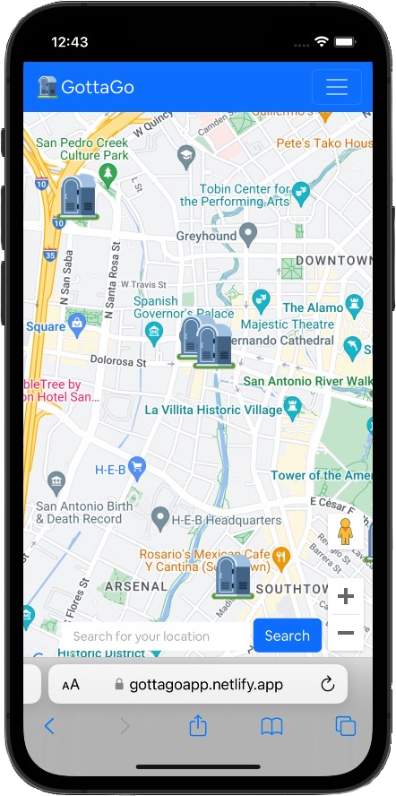
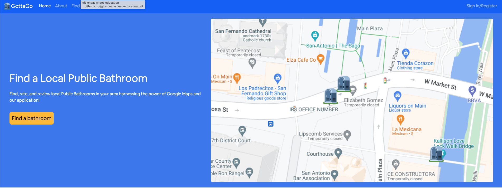
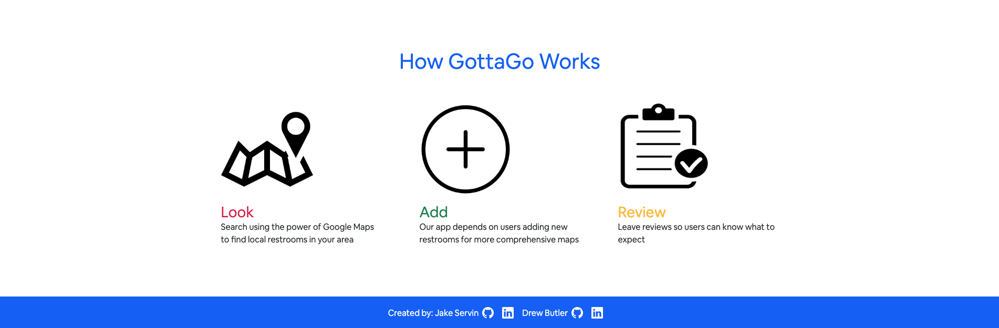
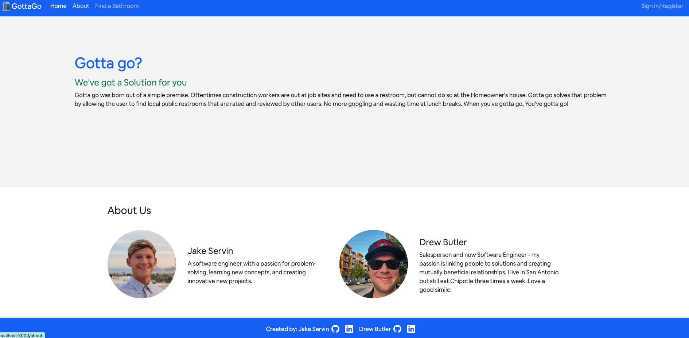
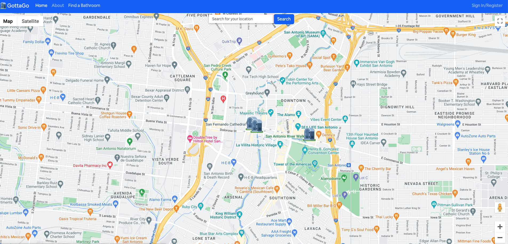
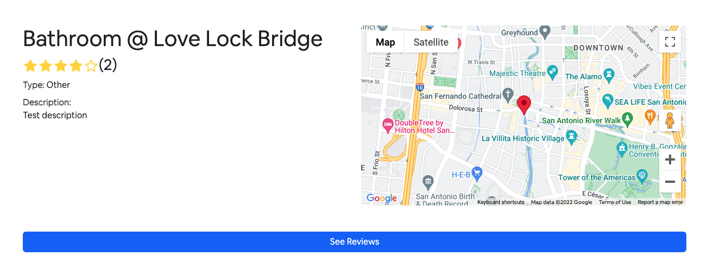

# GottaGo

## Overview

GottaGo is a website that helps users find a public restroom in their area. Users can sign in, search their location, and find restrooms that have been added by other users. Restrooms have an option to review so that other users can know what to expect once they get to the bathroom. Data is stored in the database so when someone searches an area prior additions display. 

## Technologies used:

-Javascript

-React

-Redux

-MongoDB

-Bootstrap

-CSS

### API:

-[Google Maps API](https://developers.google.com/maps)

## Screenshots:

### Home Page:

#### Top Half:

#### Bottom Half:

### About Page:

### Find a Bathroom Page:

-Search bar allows user to input location with town name or zip code to find bathrooms in their area quickly

### Reviews Page:

#### Add a bathroom:

-Add type, description, link to directions

#### Bathroom info:

-Link allows user to click for Google Maps instructions

#### Built by @JakeServin and @awbutler

#### Check us out on LinkedIn: [Jake](https://www.linkedin.com/in/jakeservin/) [Drew](https://www.linkedin.com/in/drewbutlermba/)
